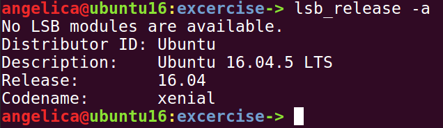
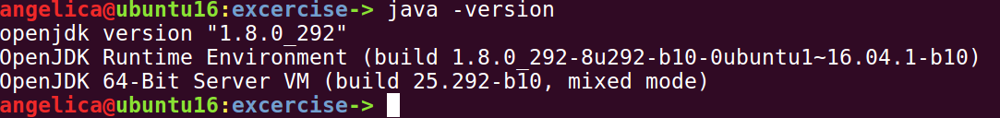
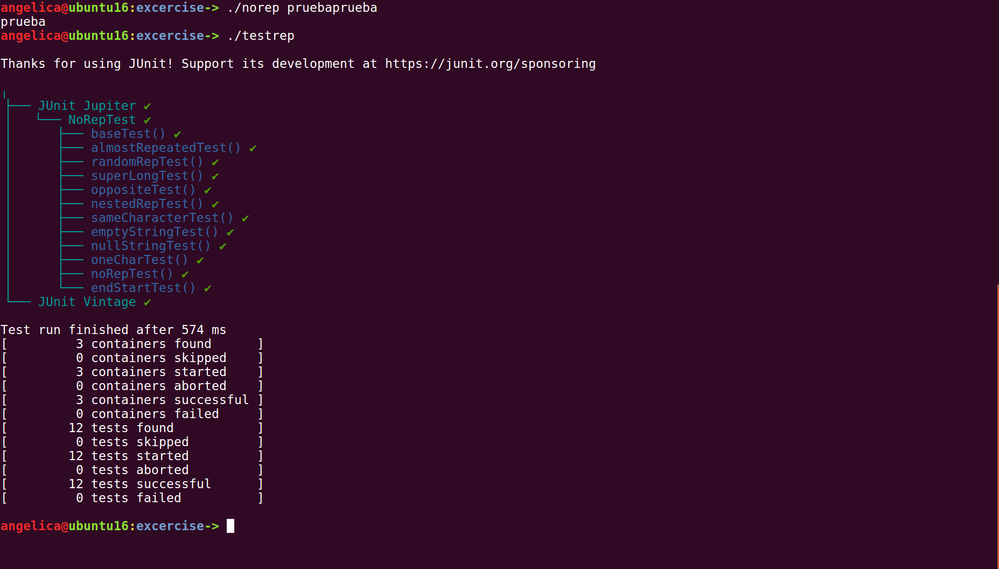

## Exercise

This exercise contains two command line programs to process a single String for repetition patterns and returns the given String without repetitions.
The programs complie with the stated requirements.

### OS
This code was compiled and tested in Ubuntu 16.04.5 LTS

### Dependencies 
The soruce code is in java 8. It uses openjdk 1.8.0_292 to compile and execute.

There is no need to compile, the .class files are already included.

For unit test JUnit 5 jar is needed. The .jar file is provided or can be downloaded from Maven Central [https://repo1.maven.org/maven2/org/junit/platform/junit-platform-console-standalone/1.8.2/junit-platform-console-standalone-1.8.2.jar]

### Execution
Please grant execution privileges to programs

chmod +x norep

chmod +x testrep

chmod +x downloadMe

First download dependencies

- ./downloadMe

To execute the commands please use:
- ./norep stringToCheck
- ./testrep

### Additional Comments

In case compilation is needed.

- Grant execution privileges:

chmod +x compileMe

- Then execute

./compileMe

This downloads the JUnit jar and compiles the source code.

